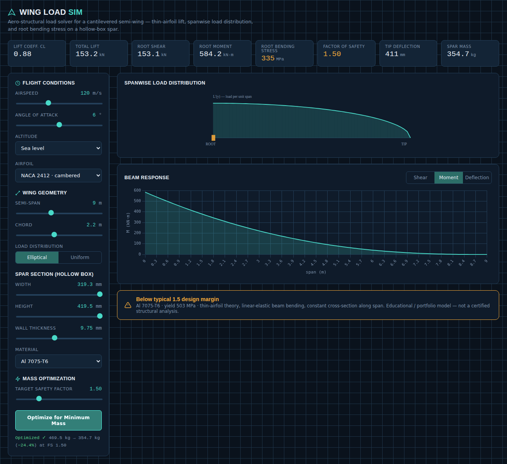

# Wing Load Sim

**Live demo:** _add your GitHub Pages link here after publishing, e.g. `https://<your-username>.github.io/wing-load-sim/`_

An interactive aero-structural load solver for a cantilevered aircraft semi-wing. Built as an extension of academic structural design work — turns a static hand-calculation into a real-time engineering tool.

## What it does

Given flight conditions, wing geometry, and a spar cross-section, the tool:

- Computes the lift coefficient from thin-airfoil theory for a selectable NACA airfoil (0012 / 2412 / 4412) and angle of attack.
- Distributes the resulting lift along the span (elliptical or uniform) and numerically integrates shear force and bending moment along the semi-wing.
- Sizes a hollow-box spar (width, height, wall thickness, material) and computes root bending stress, factor of safety, tip deflection, and spar mass.
- Flags invalid sections and angles of attack beyond the linear range of thin-airfoil theory.

All computation updates live as you move the sliders — useful for building intuition about how span, airspeed, load distribution shape, and spar sizing trade off against each other.

### Mass optimization

Beyond pass/fail analysis, the tool includes a **minimum-mass sizing search**: given a target factor of safety, it searches the spar's width/height/wall-thickness space and returns the lightest section that still meets it. For a fixed root moment, bending stress is monotonic in section height, so for every (width, thickness) pair the search binary-searches the smallest feasible height, then keeps the lowest-mass combination over a coarse-to-fine grid.

On the default flight/geometry case this drops spar mass from 469.5 kg to 354.7 kg (**−24.4%**) at the same FS = 1.5, converging on a thin-walled section pushed to the width/height envelope — the same reason real aircraft spars are thin-walled boxes rather than solid bars: moving material away from the neutral axis increases bending stiffness per unit mass.

## Engineering assumptions

This is an educational / portfolio-grade model, not a certified structural analysis:

- Thin-airfoil theory for lift (2π per radian lift-curve slope); post-stall behavior is not modeled.
- Linear-elastic beam bending (Euler-Bernoulli); constant cross-section along the span.
- Rectangular hollow-box spar as the sole load-carrying member (no skin, ribs, or shear web contribution).
- Elliptical or uniform spanwise load distribution as idealized cases.

## SolidWorks link

Two ways to connect this to a real SolidWorks part, from lightest to most automated:

- **Manual (macro only):** click **Export .json (manual / macro)**, then run
  the companion VBA macro (`WingLoadSim_SolidWorksLink.swp.bas`) inside
  SolidWorks. Full setup in [`SOLIDWORKS_SETUP.md`](./SOLIDWORKS_SETUP.md).
- **Live (bridge app):** run the local bridge server (`bridge_app/`) and
  click **Send to SolidWorks (Live)** — no macro step, SolidWorks updates
  directly while you work the sliders. See
  [`bridge_app/README_BRIDGE.md`](./bridge_app/README_BRIDGE.md).

Either way, this isn't a connection over the internet — the browser only
ever talks to `localhost`, your own machine.

## Tech

Single self-contained HTML file — vanilla JavaScript for the numerical model, Chart.js (bundled inline, no external dependency) for the shear/moment/deflection plots, and inline SVG for the load-distribution diagram. No build step, no backend.

## Run locally

Clone the repo and open `index.html` in any browser — no installation required.

## Why I built this

This tool extends the wing structural design work from my B.Sc. in Aerospace Engineering (UNAM) — instead of a one-off hand calculation, it's a reusable tool that lets you explore the design space (spar sizing vs. flight envelope) in real time.

## License

MIT
